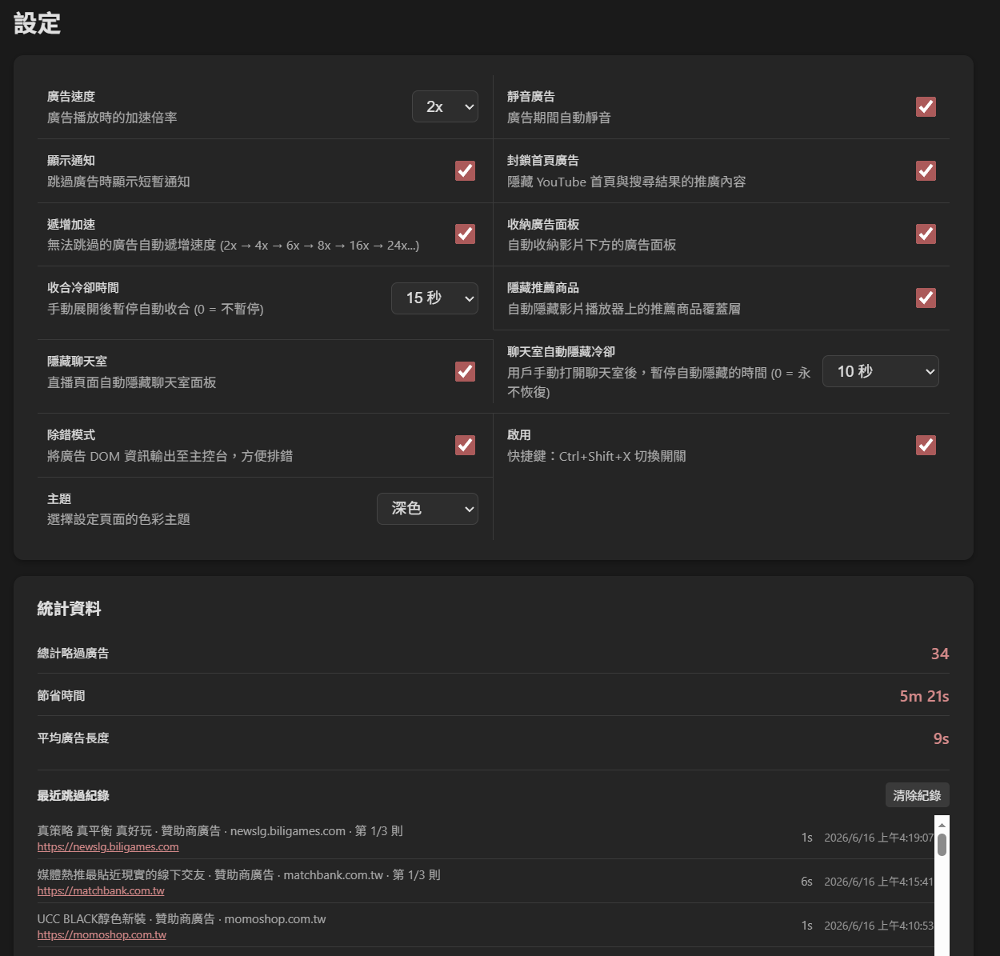
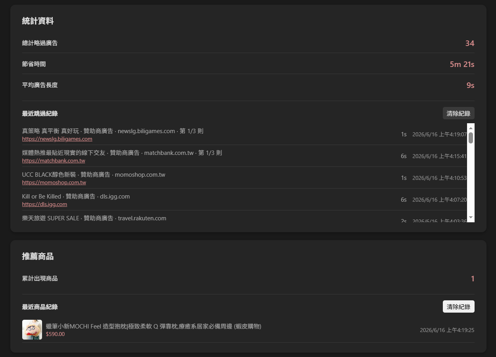

# SkipAds — YouTube Ad Skipper

<p align="center">
  
  &nbsp;&nbsp;
  
</p>

輕量級 Edge 擴充功能，自動跳過 YouTube 廣告，支援加速、靜音、首頁廣告封鎖。

## 理念

廣告可以存在，但不該影響觀看體驗。

我們理解平台需要廣告收益，但**不應強迫用戶看完固定時長**才能略過。有些時候看到廣告標題就已經知道內容了，剩下的只是等待時間。

這個工具不是要完全消滅廣告，而是把選擇權還給用戶——讓廣告「出現」，但不要「強迫」。加速、靜音、跳過，都是為了同一個目的：**廣告可以顯示，但不該強迫我看那麼久。**

## 功能

- **自動跳過廣告** — 偵測跳過按鈕並自動點擊，無需等待（可關閉以避免被 YouTube 偵測）
- **加速播放** — 廣告期間加速播放（預設 2x），減少等待時間
- **遞增加速** — 無法跳過的廣告自動遞增速度 (2x→4x→6x→8x→16x→24x...)，越播越快
- **自動靜音** — 廣告期間自動靜音（含獨立廣告影片元素），結束後恢復原本狀態
- **收納廣告面板** — 自動收合影片下方的贊助商廣告面板
- **首頁廣告封鎖** — 隱藏 YouTube 首頁與搜尋結果的推廣內容
- **隱藏聊天室** — 直播頁面自動隱藏聊天室；用戶手動開啟後暫停自動隱藏（可設定冷卻時間）
- **隱藏推薦商品** — 自動隱藏播放器上的購物推薦商品覆蓋層，商品資訊仍記入統計
- **Toast 通知** — 跳過廣告時顯示短暫通知（含廣告標題）
- **統計資料** — 記錄廣告與推薦商品的統計，包含次數、節省時間與最近紀錄（最多各 50 筆）
- **主題切換** — 設定頁支援跟隨系統、淺色、深色三種模式
- **快捷鍵** — `Ctrl+Shift+X` 快速開關
- **多語言** — 支援繁體中文與 English

## 安裝

詳細步驟請見 [INSTALL.md](INSTALL.md)。

快速版：
1. 開啟 Edge，前往 `edge://extensions`
2. 開啟左上角 **開發人員模式**
3. 點選 **載入解壓縮**，選取 `skipads` 資料夾
4. 確認 SkipAds 出現在列表中且已啟用

## 設定

點選工具列擴充圖示 → 齒輪圖示，或右鍵 → 選項：

| 設定 | 說明 |
|------|------|
| 廣告速度 | 廣告播放時的倍率 (2x / 4x / 8x / 16x) |
| 遞增加速 | 無法跳過的廣告自動遞增速度，越播越快 |
| 靜音廣告 | 廣告期間自動靜音（含獨立廣告影片元素） |
| 顯示通知 | 跳過廣告時顯示 Toast 通知 |
| 封鎖首頁廣告 | 隱藏首頁與搜尋推廣內容 |
| 收納廣告面板 | 自動收合影片下方的贊助商廣告面板 |
| 收合冷卻 | 手動展開後暫停自動收合時間 (0 = 不暫停) |
| 自動點擊略過按鈕 | 自動點擊廣告的略過按鈕；關閉後僅加速與靜音廣告（關閉可避免被 YouTube 偵測為 adblock） |
| 啟用 | 開關擴充功能（快捷鍵 Ctrl+Shift+X） |
| 隱藏聊天室 | 直播頁面自動隱藏聊天室 |
| 聊天室自動隱藏冷卻 | 用戶手動開啟後暫停自動隱藏的時間 (0 = 永不恢復) |
| 隱藏推薦商品 | 隱藏播放器上的購物推薦覆蓋層，商品資訊仍記入統計 |
| 除錯模式 | 輸出廣告 DOM 資訊至主控台 |
| 主題 | 設定頁色彩：跟隨系統 / 淺色 / 深色 |

## 贊助支持

如果你覺得這個工具對你有幫助，歡迎透過以下方式贊助一杯咖啡 ☕

- [PayPal](https://paypal.me/coffeelatte0709)
- [TikTok](https://www.tiktok.com/@coffeelatte0709?_r=1&_t=ZS-914gBZGkAKO)
- [街口支付](https://service.jkopay.com/r/transfer?j=Transfer:911210964)
- [Twitch 贈送訂閱](https://www.twitch.tv/coffeelatte0709)

你的支持是持續開發的動力，感謝！

## 技術說明

- Manifest V3，僅需 `storage` 權限
- 支援 Chrome / Edge（Chromium）與 Firefox 113+
- 只作用於 `youtube.com`，不讀取其他網站
- **無遠端設定**、**無追蹤**、**無唯一識別碼**
- 使用 `timeupdate` 事件偵測廣告狀態（影片播放時觸發，每秒檢查一次），廣告面板用 2 秒輪詢
- 廣告標題從 `.ytp-ad-avatar-lockup-card__headline`、`ad-simple-attributed-string` 等取得
- 跳過按鈕使用 `trustedClick` 機制（injected script 模擬點擊），支援 `.ytp-ad-skip-button-modern` 等略過按鈕
- ⚠️ 自動點擊略過按鈕的行為可能被 YouTube 誤判為 adblock 插件，從而觸發「允許 YouTube 放送廣告」或「2 則後封鎖」等提示。若遇到此情況，請在設定中關閉「自動點擊略過按鈕」，擴充功能仍會加速與靜音廣告。
- 統計資料儲存在本地 `chrome.storage.local`

## 檔案結構

```
skipads/
├── manifest.json          # 擴充功能資訊（依瀏覽器切換）
├── manifest-chrome.json   # Chrome/Edge 專用 manifest
├── manifest-firefox.json  # Firefox 專用 manifest
├── switch-browser.ps1     # 瀏覽器切換腳本
├── _locales/
│   ├── en/messages.json   # English 翻譯
│   └── zh/messages.json   # 繁體中文翻譯
├── icons/
│   └── icon128.png        # 擴充圖示 (128x128)
├── script/
│   ├── background.js      # Service Worker
│   └── content-script.js  # 主要廣告偵測與跳過邏輯
└── options/
    ├── options.html       # 設定頁面
    └── options.js         # 設定邏輯
```

## 版本紀錄

**v2.7** — 自動點擊開關 & 反偵測
- 新增「自動點擊略過按鈕」開關：關閉後不再點擊略過按鈕，改為僅加速與靜音廣告，避免被 YouTube 誤判為 adblock
- 新增設定頁面選項，用戶可自行切換
- 更新繁體中文與 English 翻譯

**v2.6** — 推薦商品開關 & 統計獨立區塊
- 新增「隱藏推薦商品」開關，用戶可自行決定是否隱藏播放器上的購物推薦覆蓋層
- 新增「推薦商品」獨立統計區塊：紀錄商品標題、價格、店家、縮圖，可獨立清除
- 改用永久 CSS 規則隱藏推薦商品（`.ytp-featured-product{display:none!important}`），YouTube 重建元素也立即隱藏
- 新增去重邏輯：相同商品不重複紀錄
- 設定頁寬螢幕適配：最大寬度 960px，設定項目改為 2 欄網格佈局，字型與間距放大
- 推薦商品統計可獨立清除，不影響廣告統計數據

**v2.5** — 聊天室自動隱藏重寫 & 隱藏推薦商品
- 新增隱藏播放器上的購物推薦商品覆蓋層（`.ytp-suggested-action-badge`）
- 修復聊天室隱藏打錯靶的問題：selector 從 `#panels-full-bleed-container` 改為 `#chat-container, #panels-full-bleed-container`（聊天室實際在 `#chat-container` 內的 iframe）
- 改用 `visibility: hidden; height: 0` 取代 `display: none`，避免觸發 YouTube 版面重排導致影片卡住
- 新增三重保護機制：document 層級 DOM observer + 元素 style observer + 2 秒 interval 備份
- 修復 SPA 導航後「開啟面板」按鈕消失的問題（`setChatHide` 自動確保按鈕存在）
- 修復 `watchChat` 被重複呼叫導致 observer/interval 不斷重建的問題
- 隱藏後觸發 `resize` 事件 + 強制 reflow 加速 YouTube 版面更新

**v2.4** — 穩定性修復 & CSP 相容性
- 修復 MutationObserver 無限迴圈導致 YouTube 頁面卡死的問題
- 修復 `clickEl` 遺失函數導致跳過按鈕無法點擊的問題
- 支援 `ytp-video-interstitial-buttoned-centered-layout` 新型廣告格式的略過按鈕
- 修復 Extension context invalidated 錯誤（extension 更新後 `chrome.storage` 斷線）
- 修復統計時間錯誤：廣告結束後誤讀主影片長度（如 150h 直播）導致節省時間暴增
- 修復廣告靜音誤觸主影片：Observer 搶在 `adOriginalMuted` 捕捉前靜音，導致廣告結束後主影片持續靜音
- 新增廣告目標連結記錄：自動抓取廣告落地網址，可在統計紀錄中點擊跳轉
- 新增頁面載入假性廣告過濾：廣告持續不足 1 秒不計入統計，避免導航期間誤報
- 新增 CSP 政策已知限制說明（建議安裝 Disable CSP 插件）

**v2.3** — 聊天室關閉修復
- 修復 YouTube 聊天室按鈕結構變更導致無法自動收合的問題
- 更新選取器支援新版 `div#close-button > yt-button-renderer` 結構

**v2.2** — Firefox 上架、統計修復、安全性優化
- Firefox 版本送審 AMO（支援 Firefox 142+）
- 新增 Firefox Developer Edition 手動安裝指南
- 新增 `build-firefox.ps1` XPI 打包工具
- 修復選項統計數據的渲染與設定的預設值（[#1](https://github.com/TwhomeGH/adFixTools/pull/1)）
- 修復 AMO 審查：補齊 `data_collection_permissions`、移除 `innerHTML`
- 統計歷史紀錄標題可點擊展開／收合
- 新增 `docs/build-firefox.md` 打包文件
- 新增捐款贊助資訊（PayPal / TikTok / 街口支付 / Twitch）

**v2.1** — 遞增加速 & 廣告面板收納
- 新增遞增加速模式：無法跳過的廣告自動加速 (2x→4x→6x→8x→16x→24x...)
- 新增自動收納廣告面板：收合影片下方的贊助商廣告區塊
- 更新設定頁面，支援新功能開關

**v2.0** — 完整重寫
- 移除所有遠端設定與追蹤程式碼
- 重構為 Manifest V3
- 新增多語言支援
- 新增 Toast 通知（含廣告標題）
- 精簡權限至最低需求
